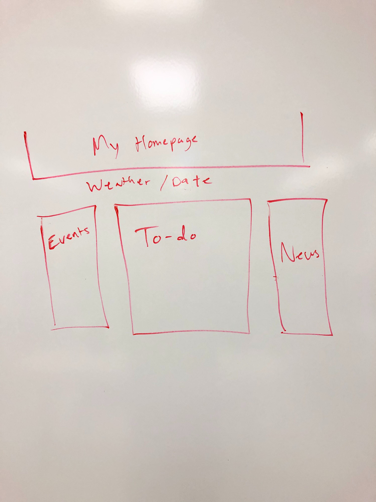

# Project-1, Daily Homepage 

## PROJECT DESCRIPTION

The purpose of this website is to provide the user with their daily to-do list, news, weather, and local events. 

## USER STORY

AS A busy person

I WANT to be able to quickly see important information about my day

SO THAT I can keep up-to-date with current events and plan my day efficiently.

## WIREFRAME

## API'S TO BE USED

* NewsAPI.org - provide daily news stories
* OpenWeatherMap.org - provide weather forecast
* TicketMaster.com - provide events for specified area
* MomentJS.com - provide date and time functionality

## ROUGH BREAKDOWN OF TASKS

1. HTML
2. CSS
* Styling
* Framework
* Responsiveness (Mobile-First)
3. JavaScript
* Events
* News
* Weather
* To-Do List
