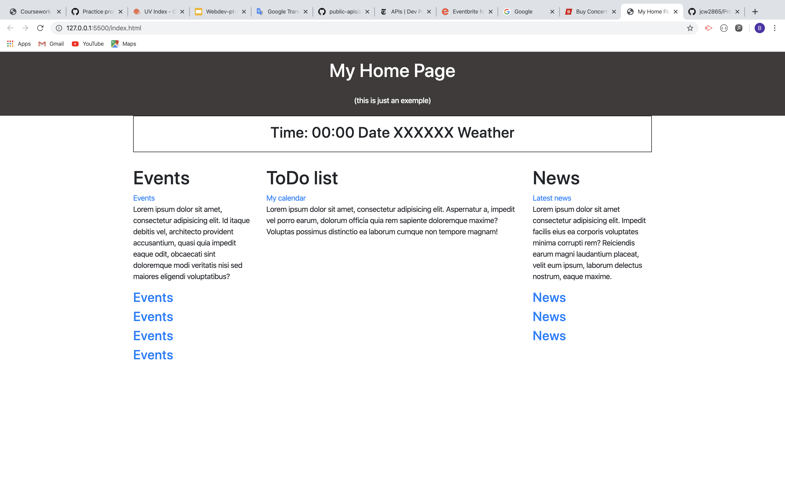

# Project-1, Daily Homepage 

The deployed site can be found here: https://jcw2865.github.io/Daily-Homepage/

## PROJECT DESCRIPTION

The purpose of this website is to provide the user with their daily to-do list, news, weather, and local events. 

## USER STORY

AS A busy person

I WANT to be able to quickly see important information about my day

SO THAT I can keep up-to-date with current events and plan my day efficiently.

## WIREFRAME

## API'S TO BE USED

* NewsAPI.org - provide daily news stories
* OpenWeatherMap.org - provide weather forecast
* TicketMaster.com - provide events for specified area
* MomentJS.com - provide date and time functionality

## ROUGH BREAKDOWN OF TASKS

1. HTML
2. CSS
* Styling
* Framework
* Responsiveness (Mobile-First)
3. JavaScript
* Events
* News
* Weather
* To-Do List

## PROPOSED USER FLOW
Upon arriving at the website, there are four elements for the user to engage with. 

The first element is the events element. This section will automatically populate with events based off of the user's current location. Users will be able to click on each respective link to see more details.

The second element is the news. This section will automatically populate with the top headlines from NewsAPI.org. Users will be able to click on each respective link to see the full article. 

The third element is the weather element. The user won't necessarily engage with the weather element, but rather the user's location will be used to display the current forecast, time, and date. 

The fourth element is the to-do list. The user will be able to see an input box for each hour of the day. Users will be able to enter text into each input box and save it. This will allow users to add and remove tasks they may do on a daily basis.

Please see the image below for a visual flow chart. 

